Load libraries.

Using Seurat v2.0.


```r
library(Seurat)
```

```
## Loading required package: ggplot2
```

```
## Loading required package: cowplot
```

```
## 
## Attaching package: 'cowplot'
```

```
## The following object is masked from 'package:ggplot2':
## 
##     ggsave
```

```r
library(dplyr)
```

```
## 
## Attaching package: 'dplyr'
```

```
## The following objects are masked from 'package:stats':
## 
##     filter, lag
```

```
## The following objects are masked from 'package:base':
## 
##     intersect, setdiff, setequal, union
```

```r
library(gridExtra)
```

```
## 
## Attaching package: 'gridExtra'
```

```
## The following object is masked from 'package:dplyr':
## 
##     combine
```

Read in DigitalExpression matrix.


```r
dge <- read.table("DigitalExpression_anonymized_to_send_to_Seurat_help.txt",header=TRUE,row.names=1,check.names=FALSE)
```

Make Seurat object.


```r
threshold_for_expressed = 3
min_cells_per_gene = 3
min_genes_per_cell = 500

seurat.obj <- CreateSeuratObject(raw.data = dge,min.cells = min_cells_per_gene,min.genes = min_genes_per_cell,is.expr = threshold_for_expressed,names.field=2,names.delim="-")
```

Get mitochondrial rates, and add them to the Seurat object.


```r
raw_data <- seurat.obj@raw.data
raw_data <- raw_data[,colnames(seurat.obj@data)]

mito.genes <- grep(pattern = "^MT-", x = rownames(raw_data),value=TRUE,ignore.case=TRUE)
percent.mito <- colSums(raw_data[mito.genes, ])/colSums(raw_data)
percent.mito <- as.numeric(as.vector(percent.mito))*100
names(percent.mito) <- colnames(raw_data)

seurat.obj <- AddMetaData(object = seurat.obj,metadata = percent.mito,col.name = "percent.mito")
```

Make some QC plots.


```r
mycol <- c("#E69F00", "#56B4E9", "#009E73", "#F0E442", "#0072B2", "#D55E00", "#CC79A7","#490092")

qc_for_GenePlot <- data.frame(nUMI = seurat.obj@meta.data$nUMI,y = c(seurat.obj@meta.data$percent.mito,seurat.obj@meta.data$nGene),Panel.name = rep(c("y = percent.mito","y = nGene"),each=nrow(seurat.obj@meta.data)),Pool = seurat.obj@meta.data$orig.ident)

VlnPlot(object = seurat.obj,features.plot = c("nGene", "nUMI", "percent.mito"), nCol = 3,x.lab.rot=TRUE,cols.use=mycol)
```

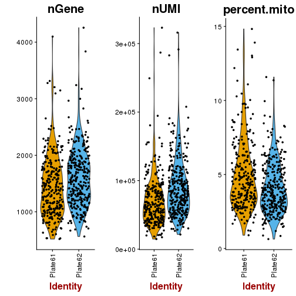

```r
ggplot(qc_for_GenePlot,aes(nUMI,y,colour=Pool)) + geom_point(size=2) + facet_wrap(~Panel.name,nrow=1,scales="free_y") + scale_colour_manual(values=mycol)
```

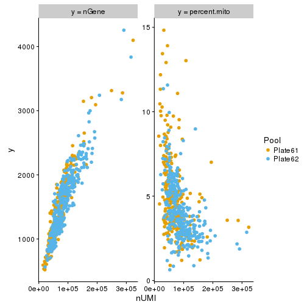

Based on this, not doing any additional filtering based on any of the parameters shown (nUMI/nGene/percent.mito).

Normalize the data.
Increase scale.factor argument to 100,000 from vignette example of 10,000 to account for higher counts for this protocol.


```r
seurat.obj <- NormalizeData(object = seurat.obj,normalization.method = "LogNormalize", scale.factor=1e5)
```

```
## [1] "Performing log-normalization"
```

Get variable genes.
Increase minimum expression and variability required to call a gene as variable from the lower thresholds in vignette.
This is again to account for higher coverage/lower cell number protocol.


```r
x_low_cutoff = 0.1
y_low_cutoff = 1.25

seurat.obj <- FindVariableGenes(object = seurat.obj, mean.function = ExpMean, dispersion.function = LogVMR, x.low.cutoff=x_low_cutoff,y.cutoff=y_low_cutoff)
```

```
## [1] "Calculating gene dispersion"
## 
  |                                                                       
  |                                                                 |   0%
  |                                                                       
  |=====                                                            |   7%
  |                                                                       
  |=========                                                        |  14%
  |                                                                       
  |==============                                                   |  21%
  |                                                                       
  |===================                                              |  29%
  |                                                                       
  |=======================                                          |  36%
  |                                                                       
  |============================                                     |  43%
  |                                                                       
  |================================                                 |  50%
  |                                                                       
  |=====================================                            |  57%
  |                                                                       
  |==========================================                       |  64%
  |                                                                       
  |==============================================                   |  71%
  |                                                                       
  |===================================================              |  79%
  |                                                                       
  |========================================================         |  86%
  |                                                                       
  |============================================================     |  93%
  |                                                                       
  |=================================================================| 100%
```

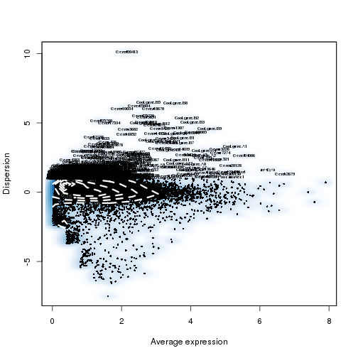

```r
length(seurat.obj@var.genes)
```

```
## [1] 429
```

Scale the data and remove unwanted sources of variation.


```r
seurat.obj <- ScaleData(object = seurat.obj,vars.to.regress = c("nUMI", "percent.mito"))
```

```
## [1] "Regressing out nUMI"         "Regressing out percent.mito"
## 
  |                                                                       
  |                                                                 |   0%
  |                                                                       
  |                                                                 |   1%
  |                                                                       
  |=                                                                |   1%
  |                                                                       
  |=                                                                |   2%
  |                                                                       
  |==                                                               |   3%
  |                                                                       
  |==                                                               |   4%
  |                                                                       
  |===                                                              |   4%
  |                                                                       
  |===                                                              |   5%
  |                                                                       
  |====                                                             |   6%
  |                                                                       
  |====                                                             |   7%
  |                                                                       
  |=====                                                            |   7%
  |                                                                       
  |=====                                                            |   8%
  |                                                                       
  |======                                                           |   9%
  |                                                                       
  |=======                                                          |  10%
  |                                                                       
  |=======                                                          |  11%
  |                                                                       
  |========                                                         |  12%
  |                                                                       
  |=========                                                        |  13%
  |                                                                       
  |=========                                                        |  14%
  |                                                                       
  |=========                                                        |  15%
  |                                                                       
  |==========                                                       |  15%
  |                                                                       
  |==========                                                       |  16%
  |                                                                       
  |===========                                                      |  17%
  |                                                                       
  |===========                                                      |  18%
  |                                                                       
  |============                                                     |  18%
  |                                                                       
  |============                                                     |  19%
  |                                                                       
  |=============                                                    |  20%
  |                                                                       
  |==============                                                   |  21%
  |                                                                       
  |==============                                                   |  22%
  |                                                                       
  |===============                                                  |  23%
  |                                                                       
  |================                                                 |  24%
  |                                                                       
  |================                                                 |  25%
  |                                                                       
  |=================                                                |  26%
  |                                                                       
  |==================                                               |  27%
  |                                                                       
  |==================                                               |  28%
  |                                                                       
  |===================                                              |  28%
  |                                                                       
  |===================                                              |  29%
  |                                                                       
  |===================                                              |  30%
  |                                                                       
  |====================                                             |  31%
  |                                                                       
  |=====================                                            |  32%
  |                                                                       
  |=====================                                            |  33%
  |                                                                       
  |======================                                           |  34%
  |                                                                       
  |=======================                                          |  35%
  |                                                                       
  |=======================                                          |  36%
  |                                                                       
  |========================                                         |  36%
  |                                                                       
  |========================                                         |  37%
  |                                                                       
  |=========================                                        |  38%
  |                                                                       
  |=========================                                        |  39%
  |                                                                       
  |==========================                                       |  39%
  |                                                                       
  |==========================                                       |  40%
  |                                                                       
  |===========================                                      |  41%
  |                                                                       
  |===========================                                      |  42%
  |                                                                       
  |============================                                     |  42%
  |                                                                       
  |============================                                     |  43%
  |                                                                       
  |============================                                     |  44%
  |                                                                       
  |=============================                                    |  45%
  |                                                                       
  |==============================                                   |  46%
  |                                                                       
  |==============================                                   |  47%
  |                                                                       
  |===============================                                  |  47%
  |                                                                       
  |===============================                                  |  48%
  |                                                                       
  |================================                                 |  49%
  |                                                                       
  |================================                                 |  50%
  |                                                                       
  |=================================                                |  50%
  |                                                                       
  |=================================                                |  51%
  |                                                                       
  |==================================                               |  52%
  |                                                                       
  |==================================                               |  53%
  |                                                                       
  |===================================                              |  53%
  |                                                                       
  |===================================                              |  54%
  |                                                                       
  |====================================                             |  55%
  |                                                                       
  |=====================================                            |  56%
  |                                                                       
  |=====================================                            |  57%
  |                                                                       
  |=====================================                            |  58%
  |                                                                       
  |======================================                           |  58%
  |                                                                       
  |======================================                           |  59%
  |                                                                       
  |=======================================                          |  60%
  |                                                                       
  |=======================================                          |  61%
  |                                                                       
  |========================================                         |  61%
  |                                                                       
  |========================================                         |  62%
  |                                                                       
  |=========================================                        |  63%
  |                                                                       
  |=========================================                        |  64%
  |                                                                       
  |==========================================                       |  64%
  |                                                                       
  |==========================================                       |  65%
  |                                                                       
  |===========================================                      |  66%
  |                                                                       
  |============================================                     |  67%
  |                                                                       
  |============================================                     |  68%
  |                                                                       
  |=============================================                    |  69%
  |                                                                       
  |==============================================                   |  70%
  |                                                                       
  |==============================================                   |  71%
  |                                                                       
  |==============================================                   |  72%
  |                                                                       
  |===============================================                  |  72%
  |                                                                       
  |===============================================                  |  73%
  |                                                                       
  |================================================                 |  74%
  |                                                                       
  |=================================================                |  75%
  |                                                                       
  |=================================================                |  76%
  |                                                                       
  |==================================================               |  77%
  |                                                                       
  |===================================================              |  78%
  |                                                                       
  |===================================================              |  79%
  |                                                                       
  |====================================================             |  80%
  |                                                                       
  |=====================================================            |  81%
  |                                                                       
  |=====================================================            |  82%
  |                                                                       
  |======================================================           |  82%
  |                                                                       
  |======================================================           |  83%
  |                                                                       
  |=======================================================          |  84%
  |                                                                       
  |=======================================================          |  85%
  |                                                                       
  |========================================================         |  85%
  |                                                                       
  |========================================================         |  86%
  |                                                                       
  |========================================================         |  87%
  |                                                                       
  |=========================================================        |  88%
  |                                                                       
  |==========================================================       |  89%
  |                                                                       
  |==========================================================       |  90%
  |                                                                       
  |===========================================================      |  91%
  |                                                                       
  |============================================================     |  92%
  |                                                                       
  |============================================================     |  93%
  |                                                                       
  |=============================================================    |  93%
  |                                                                       
  |=============================================================    |  94%
  |                                                                       
  |==============================================================   |  95%
  |                                                                       
  |==============================================================   |  96%
  |                                                                       
  |===============================================================  |  96%
  |                                                                       
  |===============================================================  |  97%
  |                                                                       
  |================================================================ |  98%
  |                                                                       
  |================================================================ |  99%
  |                                                                       
  |=================================================================|  99%
  |                                                                       
  |=================================================================| 100%
## [1] "Scaling data matrix"
## 
  |                                                                       
  |                                                                 |   0%
  |                                                                       
  |=================================================================| 100%
```

Run PCA.
Then do PCElbowPlot to get a sense of most important PCs.


```r
seurat.obj <- RunPCA(object = seurat.obj,pc.genes = seurat.obj@var.genes,do.print = FALSE)
PCElbowPlot(seurat.obj)
```

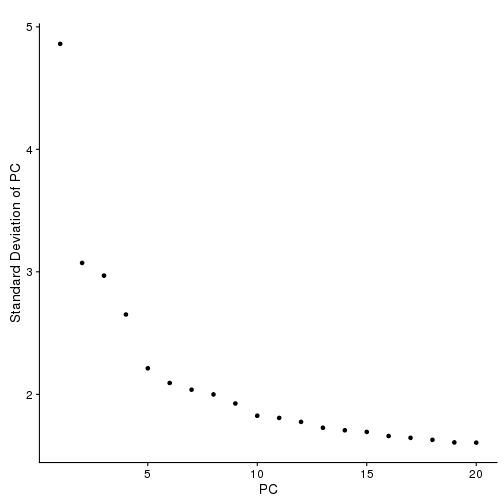

Now on to clustering.

Based on our previous correspondence, with this few cells you want to lean towards using fewer PCs in most cases.
So, let's use only the first four PCs.

With fewer cells, we will also expect fewer neighbors per cell in a cluster.
So decrease k.param to 20 from the default of 30.

Finally, let's start with a very low resolution (0.2). Can always increase it later.


```r
PCs_to_use = 1:4
k_param=20
res = 0.2

seurat.obj <- FindClusters(object = seurat.obj,reduction.type = "pca", dims.use = PCs_to_use,resolution=res,k.param=k_param,print.output = 0, save.SNN = TRUE,temp.file.location="./")
```

Run and plot tSNE.


```r
seurat.obj <- RunTSNE(object = seurat.obj,dims.use=PCs_to_use,do.fast = TRUE)
TSNEPlot(seurat.obj,colors.use=mycol)
```

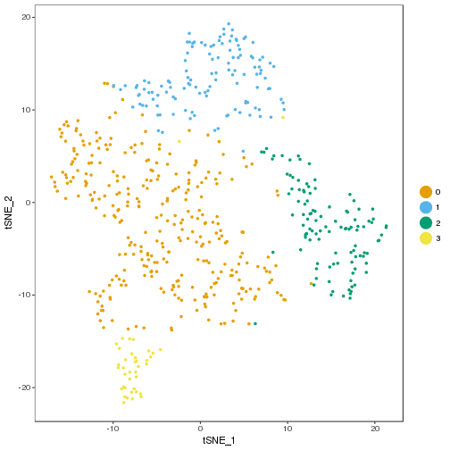

Get markers per cluster, then plot the top markers per cluster in a heatmap.


```r
all_markers_results <- FindAllMarkers(seurat.obj,only.pos=TRUE,thresh.use=0.25,min.pct = 0.25)

all_markers_results %>% group_by(cluster) %>% top_n(-12,p_val) -> top_markers_per_cluster

DoHeatmap(seurat.obj,genes.use = as.vector(top_markers_per_cluster$gene),order.by.ident = TRUE, slim.col.label = TRUE, remove.key=TRUE)
```

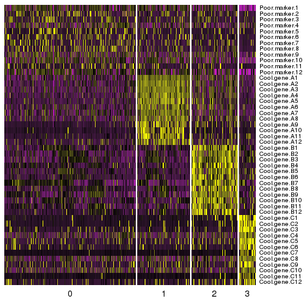

Markers for clusters 1-3 all look great.
Cluster 0, not so much.
Let's try plotting including all markers for that cluster now.


```r
genes_for_heatmap <- c(all_markers_results$gene[which(all_markers_results$cluster == 0)],top_markers_per_cluster$gene[which(top_markers_per_cluster$cluster != 0)])

DoHeatmap(seurat.obj,genes.use = genes_for_heatmap,order.by.ident = TRUE, slim.col.label = TRUE, remove.key=TRUE)
```

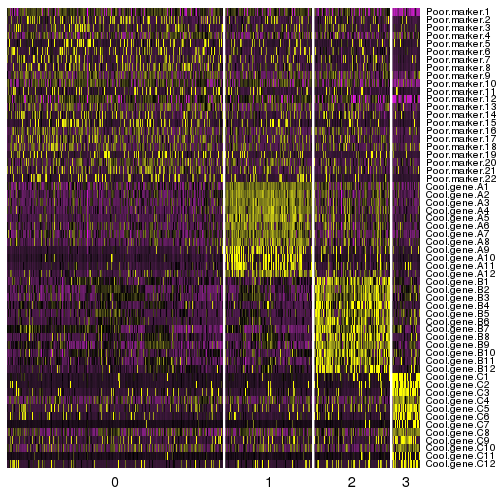

None are very good.
Maybe we need to try increasing resolution, to see if we can break that cluster into smaller clusters?


```r
res = 0.9

seurat.obj_higher_res <- FindClusters(object = seurat.obj,reduction.type = "pca", dims.use = PCs_to_use,resolution=res,k.param=k_param,print.output = 0, save.SNN = TRUE,temp.file.location="./")
```

```
## Warning in BuildSNN(object = object, genes.use = genes.use, reduction.type
## = reduction.type, : Build parameters exactly match those of already
## computed and stored SNN. To force recalculation, set force.recalc to TRUE.
```

```r
tsneplot_lower_res <- TSNEPlot(seurat.obj,colors.use=mycol)
```


```r
tsneplot_higher_res <- TSNEPlot(seurat.obj_higher_res,colors.use=mycol)
```

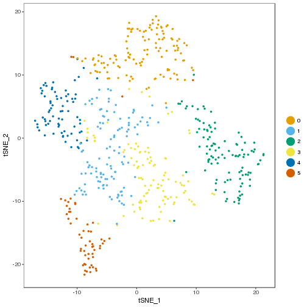

```r
grid.arrange(tsneplot_lower_res$plot,tsneplot_higher_res$plot)
```

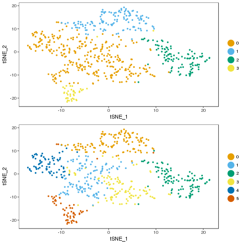

Looks like this mostly did what we want - kept the other clusters the same while breaking up 0.
Former cluster 3 is now a bit weird, but other than that the other clusters are the same.

Try finding markers again.


```r
markers_higher_res <- FindAllMarkers(seurat.obj_higher_res,only.pos=TRUE,thresh.use=0.25,min.pct = 0.25)

markers_higher_res %>% group_by(cluster) %>% top_n(-10,p_val) -> top_markers_per_cluster_higher_res

DoHeatmap(seurat.obj_higher_res,genes.use = as.vector(top_markers_per_cluster_higher_res$gene),order.by.ident = TRUE, slim.col.label = TRUE, remove.key=TRUE)
```

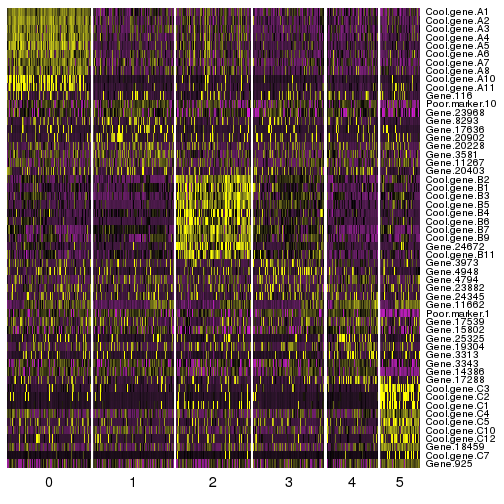

Again, markers still not very clear.

What if we try using more PCs?


```r
PCs_to_use <- 1:9

seurat.obj_higher_res_more_PCs <- FindClusters(object = seurat.obj,reduction.type = "pca", dims.use = PCs_to_use,resolution=res,k.param=k_param,print.output = 0, save.SNN = TRUE,temp.file.location="./")

seurat.obj_higher_res_more_PCs <- RunTSNE(seurat.obj_higher_res_more_PCs,dims.use=PCs_to_use,do.fast = TRUE)

TSNEPlot(seurat.obj_higher_res_more_PCs,colors.use=mycol)
```

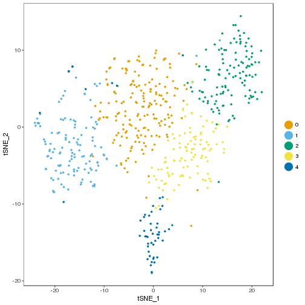

```r
markers_higher_res_more_PCs <- FindAllMarkers(seurat.obj_higher_res_more_PCs,only.pos=TRUE,thresh.use=0.25,min.pct = 0.25)

markers_higher_res_more_PCs %>% group_by(cluster) %>% top_n(-10,p_val) -> top_markers_per_cluster_higher_res_more_PCs

DoHeatmap(seurat.obj_higher_res_more_PCs,genes.use = as.vector(top_markers_per_cluster_higher_res_more_PCs$gene),order.by.ident = TRUE, slim.col.label = TRUE, remove.key=TRUE)
```

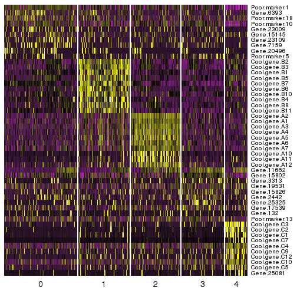

Doesn't help much.
